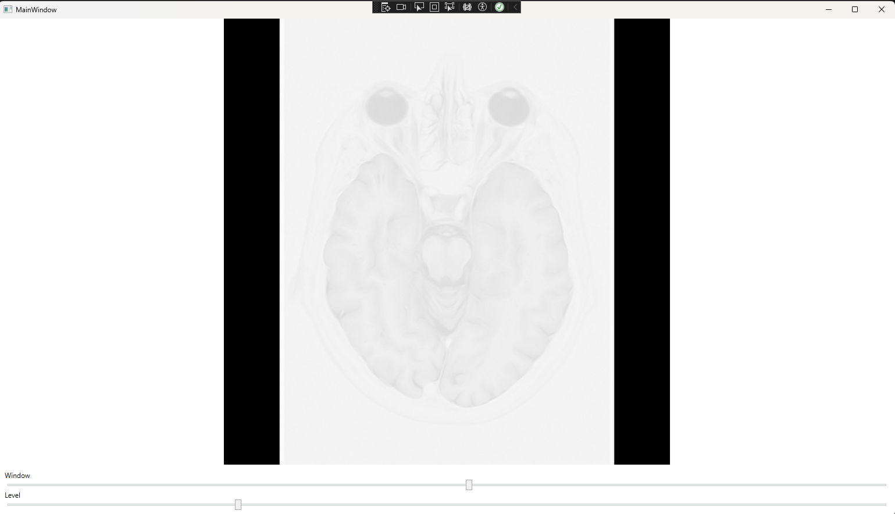
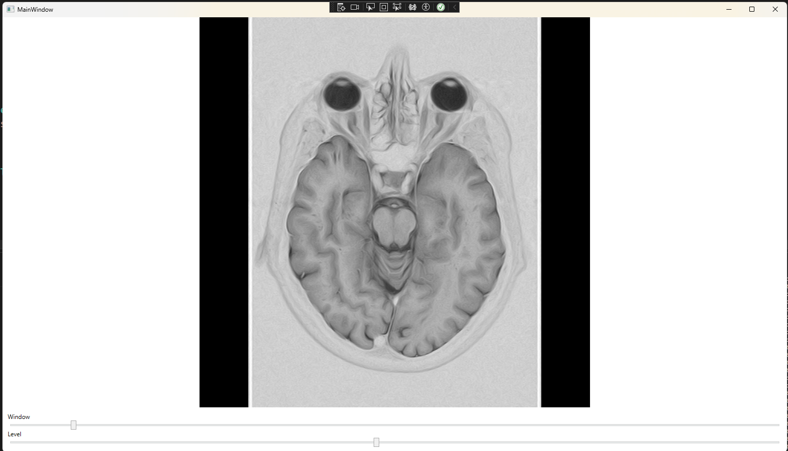

# DicomViewer

A Windows desktop application for viewing DICOM medical images. The UI is built with WPF (.NET 8) and image processing runs in a native C++ DLL via P/Invoke, keeping pixel-level operations off the managed heap.


---

## Features

- Load and display grayscale DICOM files (8-bit, 12-bit, and 16-bit)
- Interactive **Window/Level** sliders — the standard radiology contrast controls
- High-performance pixel processing in native C++ using OpenCV
- Unit-tested image processing logic with Google Test

---

## Project Structure

```
DicomViewer/
├── DicomViewer/                       # C# WPF application
│   ├── Models/
│   │   ├── DicomImageLoader.cs        # DICOM file parsing via fo-dicom
│   │   └── ImageProcessingInterop.cs  # P/Invoke bindings to the C++ DLL
│   ├── ViewModels/
│   │   └── MainViewModel.cs           # Window/level state and BitmapSource conversion
│   └── MainWindow.xaml                # Main UI layout
├── ImageProcessingLib/                # Native C++ DLL
│   ├── ImageProcessor.h               # Exported function declarations
│   └── ImageProcessor.cpp             # AdjustBrightness and AdjustWindowLevel implementations
├── ImageProcessingTests/              # C++ unit tests (Google Test)
│   └── test.cpp
└── SampleData/
    └── MRBRAIN.DCM                    # Sample MRI brain scan for development
```

---

## Prerequisites

| Dependency | Version | Notes |
|---|---|---|
| Visual Studio | 2022 | With **Desktop development with C++** and **.NET desktop development** workloads |
| .NET SDK | 8.0 | Included with Visual Studio 2022 |
| OpenCV | 4.12.0 | Must be installed and `OPENCV_DIR` set (see below) |
| NuGet | any | Used to restore fo-dicom and Google Test packages |

### OpenCV Setup

1. Download the Windows installer from the [OpenCV releases page](https://github.com/opencv/opencv/releases/tag/4.12.0) and extract to a local directory (e.g. `C:\opencv`).
2. Set the environment variable `OPENCV_DIR` to the `build` folder inside the install directory (e.g. `C:\opencv\build`). The C++ project file uses this to locate headers and libraries.

---

## Building

Open `DicomViewer.sln` in Visual Studio, set the configuration to **Debug | x64**, and build the solution (`Ctrl+Shift+B`). The C++ post-build step automatically copies `ImageProcessingLib.dll` to the WPF app's output directory.

Alternatively, from a Developer Command Prompt or PowerShell with MSBuild on `PATH`:

```powershell
& "C:\Program Files\Microsoft Visual Studio\2022\Community\MSBuild\Current\Bin\MSBuild.exe" DicomViewer.sln /p:Configuration=Debug /p:Platform=x64
```

---

## Running the Tests

After building, copy the OpenCV debug DLL to the test output folder and run the test executable:

```powershell
# Copy the OpenCV runtime DLL (only needed once per build)
Copy-Item "$env:OPENCV_DIR\x64\vc16\bin\opencv_world4120d.dll" -Destination "x64\Debug\"

# Run all tests
$env:PATH = "$env:OPENCV_DIR\x64\vc16\bin;$env:PATH"
.\x64\Debug\ImageProcessingTests.exe
```

Expected output: `11 tests from 2 test cases` — all passing.

---

## CI/CD

GitHub Actions runs on every push and pull request to `main`. The pipeline:

1. Restores NuGet packages
2. Builds the full solution in Debug x64
3. Copies the OpenCV DLL to the test output directory
4. Runs `ImageProcessingTests.exe` and publishes `test-results.xml` as a build artifact

OpenCV is cached by version between runs to keep build times short.

---

## Sample Output

The images below use the included MRI brain scan. The DICOM file was sourced from [rubomedical.com](https://www.rubomedical.com/dicom_files/).

**Default windowing**



**Adjusted windowing**



---

## Dependencies

- [fo-dicom](https://github.com/fo-dicom/fo-dicom) — DICOM file parsing
- [OpenCV](https://opencv.org/) — Native image processing
- [Google Test](https://github.com/google/googletest) — C++ unit testing framework
